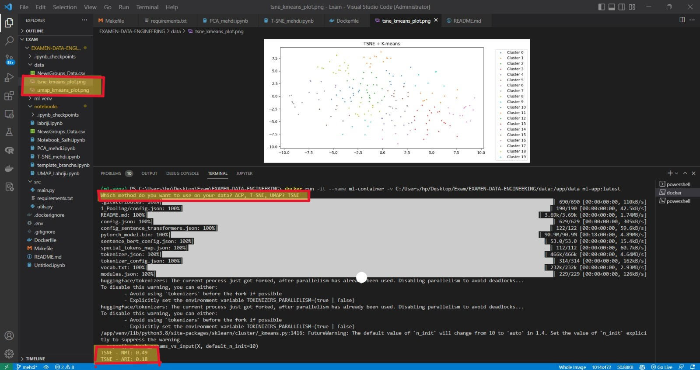
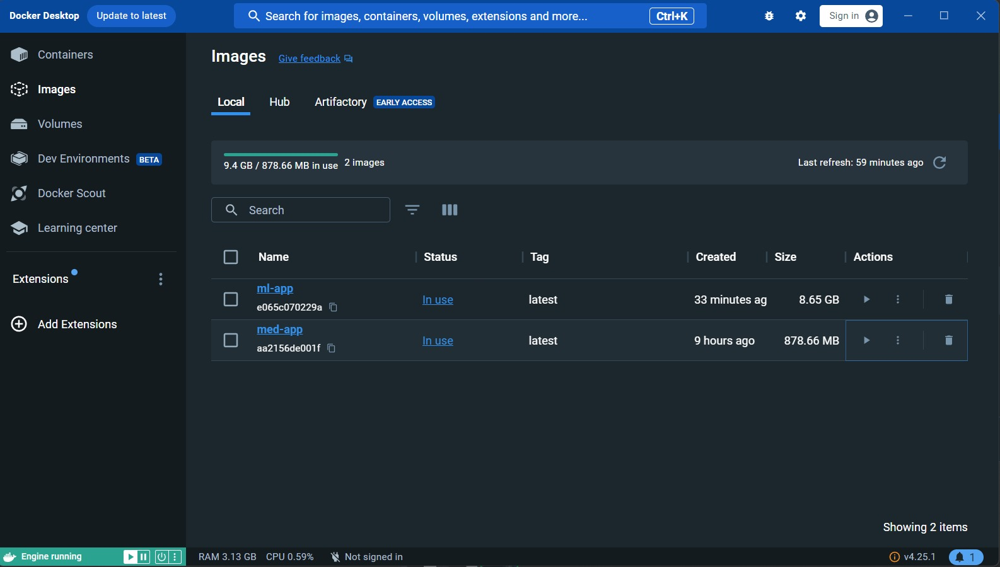
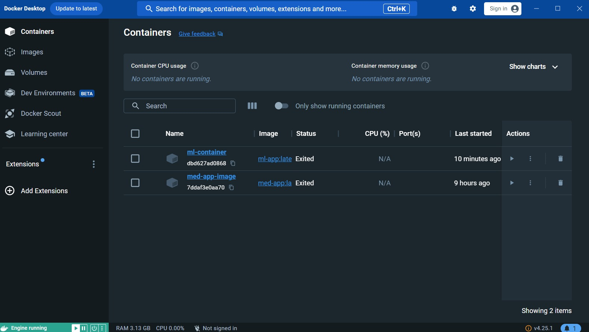

# Final Project: Data Engineering 🛠️

## Running the Application on Docker:

What you will need for this section is to build your Docker image and launch your container to test the app.
Firstly, make sure to run this command to build the app:

```bash
docker build -t ml-app .
```

You will see an image appearing, with a size of around 8 GB (due to heavy `src/requirements.txt`). 🛠️🐳

Now it's time for the container; you can run it using the following command:

```bash
docker run -it --name ml-container -v C:/Users/hp/Desktop/Exam/EXAMEN-DATA-ENGINEERING/data:/app/data ml-app:latest
```

Make sure to place the file `NewsGroups_Data.csv` in the location where you will mount the volume (in our case, the `./data/` directory). 📂📊

After this, the app will run, print the performance metrics, generate the image in the volume `./data/`. 🚀📸

Here are images showing the application is working :





## Running the Application Locally:

To locally test the code, ensure you perform the following:

1. **Update `.env` File:**
    - Open the `.env` file and adjust the `VENV_NAME` variable to your preferred virtual environment name.

2. **Run the Command:**
    - Execute the following command to effortlessly initiate the Jupyter notebook:
      ```bash
      make all-local
      ```
      **OR**
      Run the subsequent commands:
      ```bash
      make venv-setup
      make venv-install
      make local-run
      ```

After this, the app will prompt you: **"Which method do you want to use on your data? ACP, TSNE, UMAP?"**

Based on your selection, the app will run the model on the data provided in the **`./data/`** directory. Finally, a new
image will appear in the **`./data/`** directory, illustrating the results. 📊🎉

3. **Explore the Makefile:**
    - For a deeper comprehension of the concealed commands and functionalities 😉, take a moment to explore
      the [Makefile](https://github.com/labrijisaad/EXAMEN-DATA-ENGINEERING/blob/main/Makefile). Examine
      the `make all-local` section to unveil the magic unfolding behind the scenes.


## Running and Testing the Notebook Locally Made Easy! 😁

Executing the notebook locally is a breeze! Follow these straightforward steps to kickstart your experience.

### Prerequisites

Ensure the following prerequisites are in place before moving forward:

- [ ] Python installed on your machine (personally, we utilized Python 3.8.0)
- [ ] Updated values in the `.env` file to align with your preferences (we'll guide you through this) 🛠️

### Steps

1. **Update `.env` File:**
    - Open the `.env` file and modify the `VENV_NAME` variable to your chosen virtual environment name.

2. **Run the Command:**
    - Execute the following command to effortlessly launch the Jupyter notebook:
      ```bash
      make all-jupyter
      ```
      **OR**
      Run the subsequent commands:
      ```bash
      make venv-setup
      make venv-install
      make local-jupyter
      ```

3. Navigate to the notebooks directory, and you are all set 📚

4. **Explore the Makefile:**
    - For a deeper comprehension of the concealed commands and functionalities 😉, take a moment to explore
      the [Makefile](https://github.com/labrijisaad/EXAMEN-DATA-ENGINEERING/blob/main/Makefile). Examine
      the `make all-jupyter` section to unveil the magic unfolding behind the scenes.

Now, you are ready to delve into the notebook locally! Happy coding! 🚀


